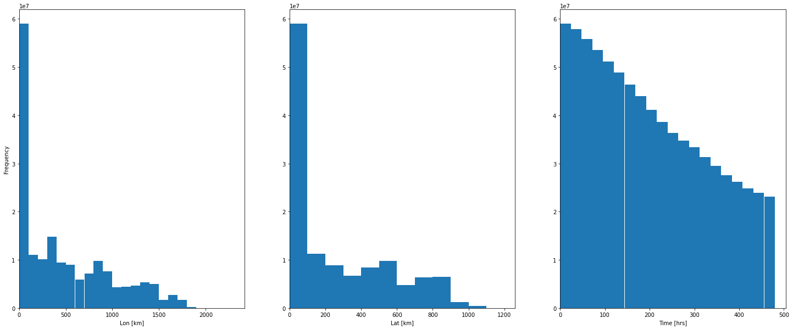
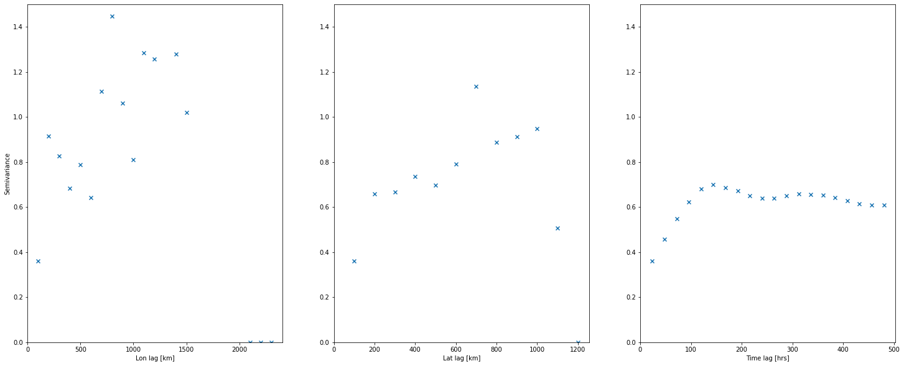
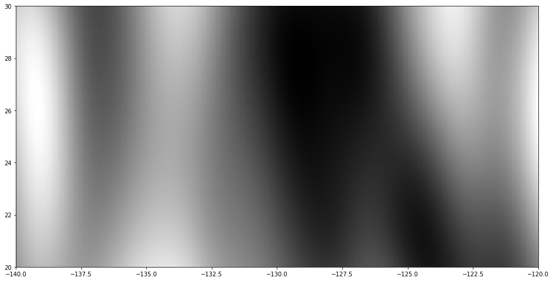

# Generative Error Model

### Download Raw Data
Use the`C3Downloader`for both Hycom and Copernicus forecasts.

Use `copernicus_hindcast_downloader` for Copernicus hindcasts.

### Creating a "Forecast/Hindcast - Buoy" Error Dataset
Use `DatasetWriter` for which meta data has to be set in the config yaml file to specify the dataset_type
which is either `forecast` or `hindcast` and the folder name.

The class will then handle downloading the appropriate buoy files in the requires range (in space and time), 
interpolate the forecast/hindcast files to the buoy positions and calculate the error returned as a pandas
DataFrame.

### Computing and Visualizing Variograms
All the variogram code is in the `variograms` directory. First one has to compute a variogram
using `compute_variogram`. Once the variogram file has been saved it can be loaded and visualized
using the `VisualizeVariogram` class.

Example output:

     
    

Once the variogram has been hand-tuned with 'good' bin sizes `VariogramFitting` can be performed to turn
obtain a set of weights and ranges. For each elemental model (e.g. one Gaussian) one obtains one weight
and three ranges, one for each dimension (lon, lat, time).

### Computing Validation Metrics
Use `ExperimentRunner` and specify the required parameters under `experiment_runner` in the yaml file.
The problems (if there are many) can be specified in a separate `problems.yaml` file.

The `ExperimentRunner` class uses the `OceanCurrentNoiseField` class which generates the spatio-temporal
noise according to the parameters obtained from the variogram analysis. An example output is shown below:

     

